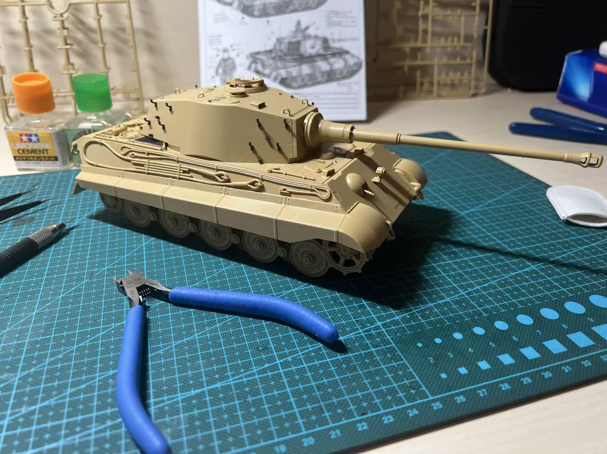
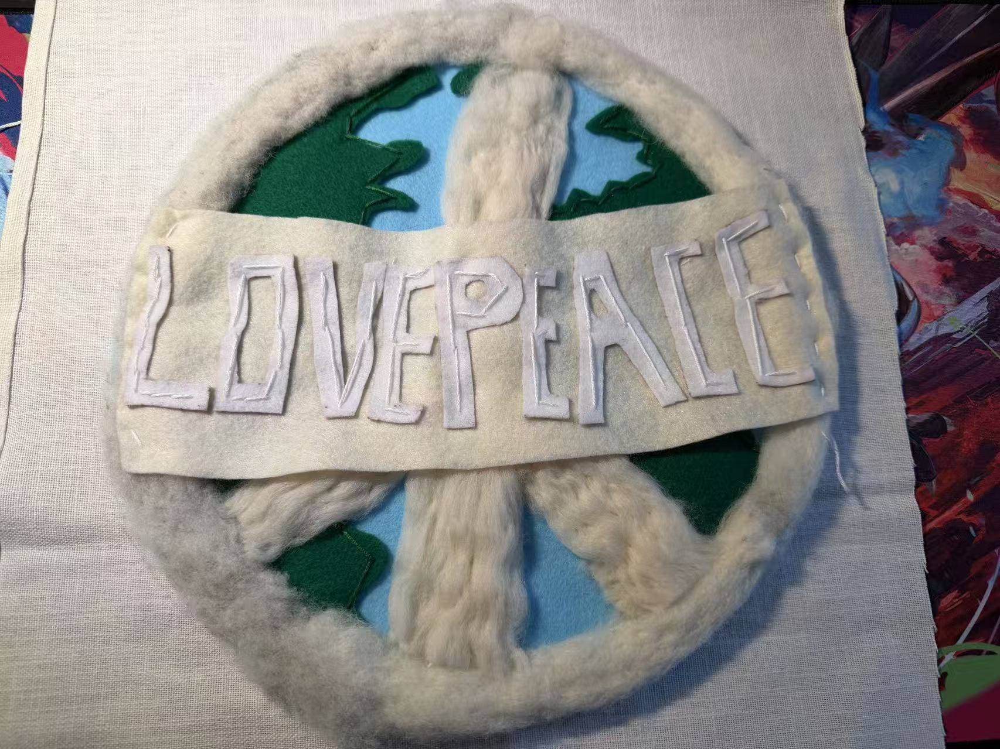
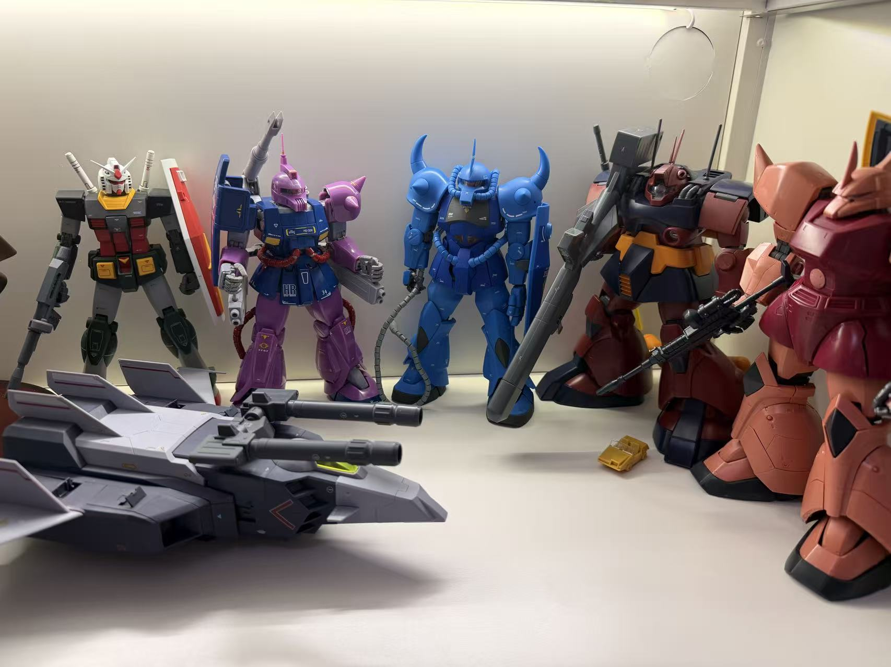

## Background

Just like I mentioned in the main page, I studied for my Bachelor's degree at UBC, My previous studies included computer science and science-related subjects, which led me to become interested in analyzing data and solving computational problems.

The most instersting topic in my learning experience is ASTR 333, a course about Astrobiology, which combines Earth Science and Astrnomy, with adding the computer techniques, it's just exactly what I want to dive into! So tha's why I was so fascinated about this topic, and I recommend this course to everyone who is insterested in this related topic.

## Why Data Science

I became interested in data science because it combines programming, statistics, and real-world problem solving. I hope to develop stronger skills in machine learning, statistical analysis, and data visualization throughout the MDS program.

## Outside the Data Science

Outside of school, I enjoy making handiwork like scaled models, knitting(actual one, not one in the RStudio!), and any other stuff too!

Making Military Models makes me feel focued on details and have fun.

Taking course named "Visual Arts for Classroom Practice: Textile Design(EDCP404)" gave me a fresh experience in handiwork.

Also, making Gunpla is also have a lot of fun!