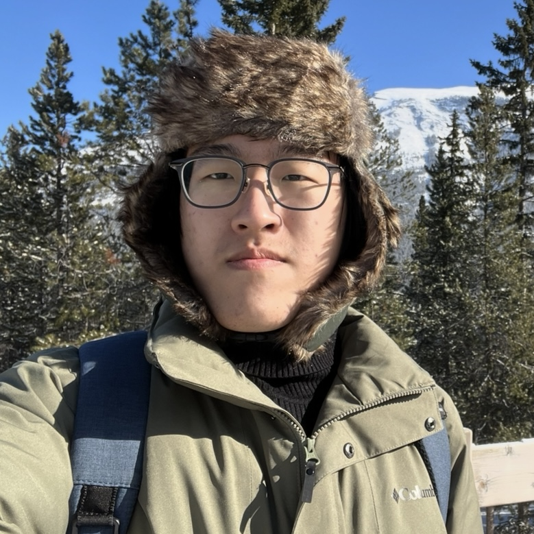

{width=250px}

Hello! My name is Jiyuan Wang. Born and raised in Wuhan, China. 

I am currently working on the Master program of Data Science in the University of British Columbia(UBC). 

Before entering this program, I finished my bachelor's degree of science in the same university here, studying Combined Major in Science (CMS), which contains three of the major in the Science faculty, Computer Science, Earth Science, and Astronomy. 

I am interested in applying data science skills and techniques to real-world problems and continuing to develop myelf throughout the MDS program. So that's why I am here, and creating this website! Thank you for reading this!