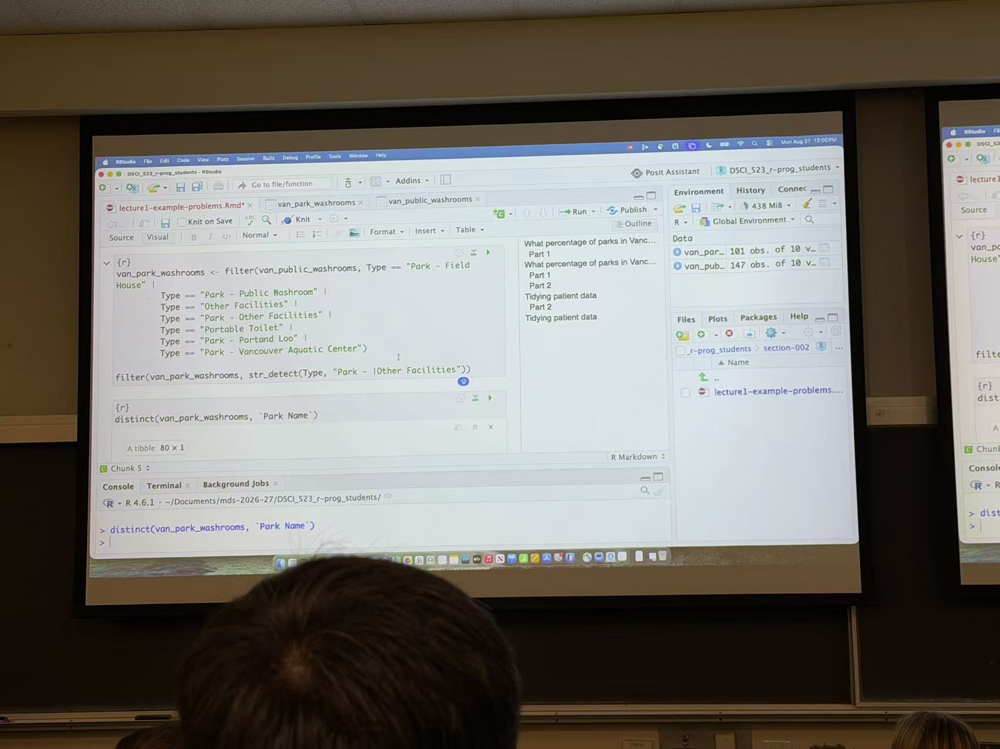

Sadly, due to the schedule conflicts, I wasn't able to attend the orientation activity, but I got to know the big pocture of the whole program little by little though the posts that uploaded in the program github page.

Just like the information I got in social media/peers, this program is indeed accelerated and fast-pace, we need to accomplish four courses within one months, and remaining this pace for the next 8 months, the tasks are challenging, but worth doing it!

Since this is a program for different background, I met lot of people in different major and campus before, it's quite a precious expereince to me!

One thing that surprised me was how many multiple skills and learning objectives in addition to programming and statistics. Learning how to use Git, GitHub, the command line, and reproducible workflows has been challenging, but I can already see why these skills are important.

Overall, I am enjoying the program and becoming more comfortable with the fast pace. I am looking forward to improving both my technical skills and my ability to solve real-world data science problems.